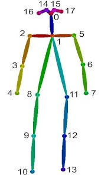
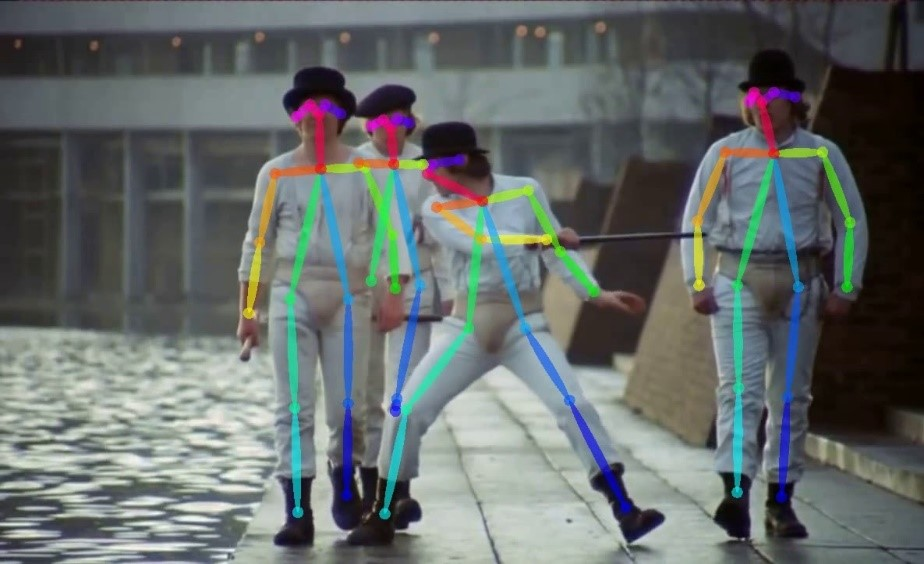
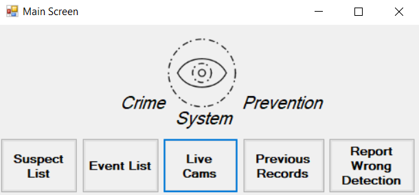
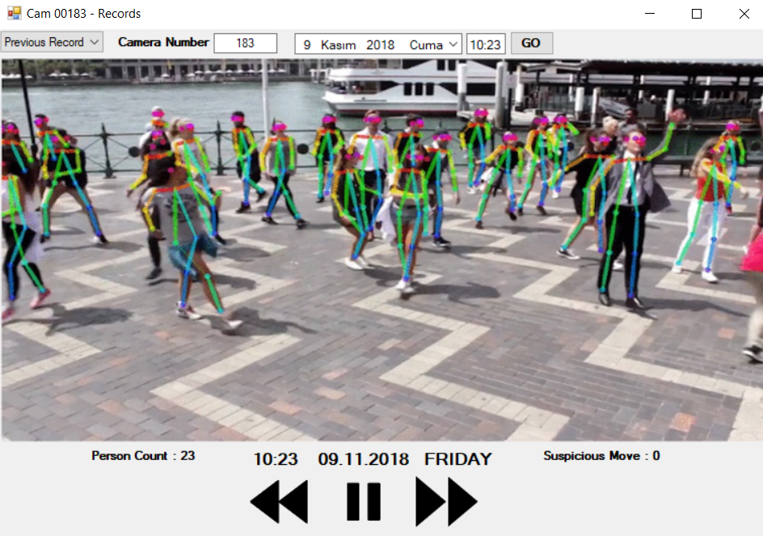
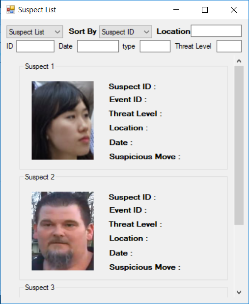
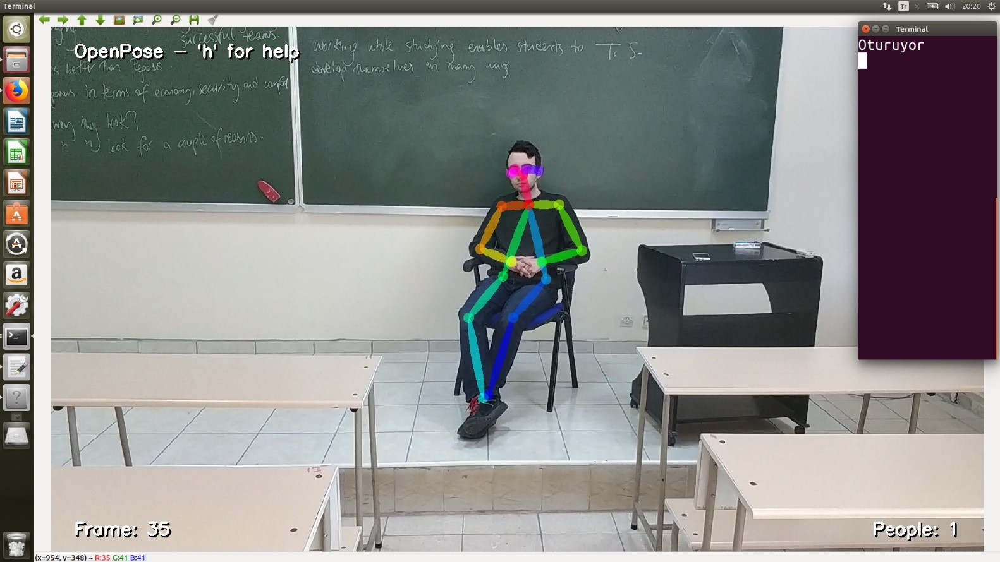
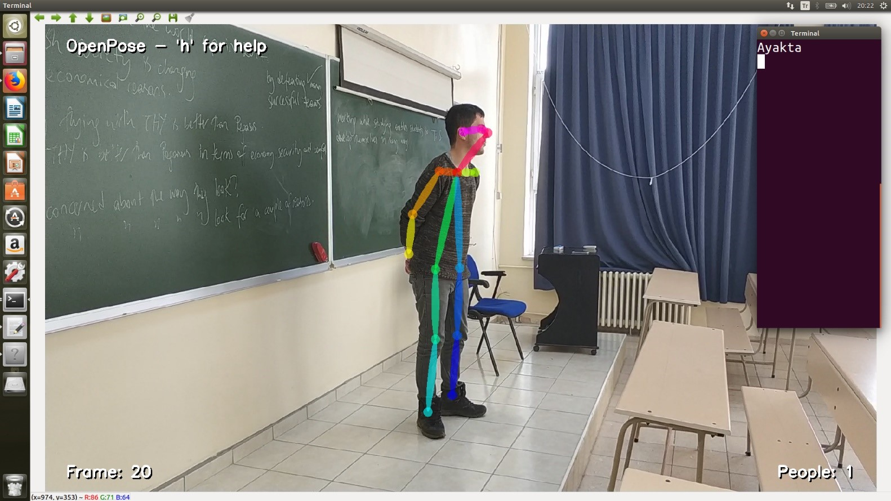
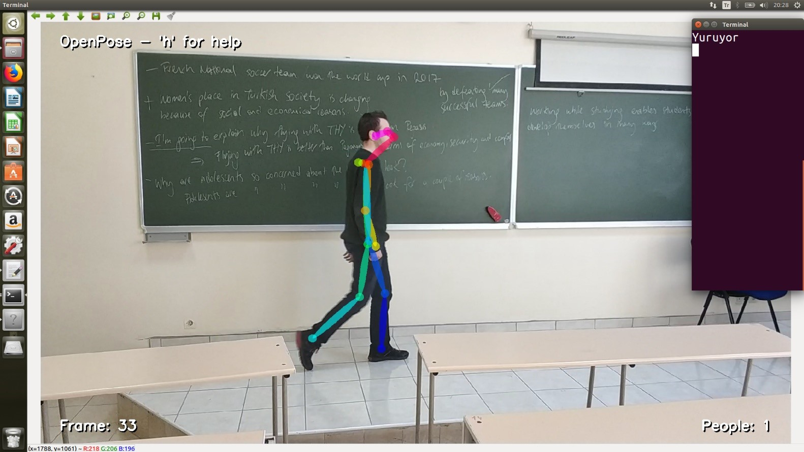

<h3>Potential Criminal Detection with Image Processing and Heuristic Methods</h3>
  This project aims to identify individual or individuals intuitively with crime potential by
combining different areas such as image processing, artificial intelligence and deep learning. For
this case, images from security cameras in open spaces must be processed in real time and
passed through a decision-making mechanism. Real-time images taken from cameras will be
processed in the center where the system is installed and changes in the posture of the person or
persons will be observed. Then the time-varying movements of this person or persons will be
examined by means of the points in the posture. Analyzes in the project will be done with a
decision mechanism. This mechanism will be a mechanism created by combining artificial
intelligence and deep learning. In order for this mechanism to make a correct decision, camera
images of previously committed crimes will be used and a model will be created as a result of the
training of the decision mechanism. The images that will be used to train the system will not only
be used at the time of the crime, but also the images used for a certain period of time
continuously. The aim of this is to analyze the psychological states and behaviors of individual or
individuals before the crime. Criminal detection using security cameras is an action that is already
in use. However, this criminal finding is based on detecting and finding the perpetrators of the
incident after the crime has been committed or the incident occurred. The main aim of the project
to be prepared is to analyze the behavior of individuals in the open area before a crime is
committed, to identify individuals who are suspicious or who are inclined to crime, and to send
the necessary notifications to the security units, for the security units to intervene in crime. The
originality of this project is to prevent the crime from being committed by working before the crime
is done. The biggest impact of the project is that it will reduce the crime rate and create a welfare
environment.
  One of the most important features of the project is that it will continuously train itself.
When the system is running in real time, the security units will be determined whether the
incoming notifications are true or false. In this way, the wrong data will be deleted from the
system and the correct data will be included in the training. Thus, the success of the decision-
making mechanism will increase continuously.
  This project is being prepared as a graduation project. The project has a project advisor
and two project managers. The first phase of the project will focus on posture analysis. A
decision-making mechanism trained for posture analysis will be established and will be provided
in real time. The calculated time for the first prototype is sixteen weeks. Within this period,
necessary planning, analysis and design will be made and the first prototype will be revealed.
Keywords: Posture detection, image processing, artifical intelligence, deep learning

a

a

a

a

a

a

a

a

<h3>System Requirements for running this project</h3>
We have used Openpose, OpenCv, Caffe, Cuda 8.0, Cudnn 5.1 for project. And we have run our project on Ubuntu 16.04 64x.
OpenPose --> https://github.com/CMU-Perceptual-Computing-Lab/openpose  
Caffe    --> http://caffe.berkeleyvision.org/ 
OpenCV   --> https://github.com/opencv/opencv/releases/tag/3.4.3 
Cuda 8.0 --> https://developer.nvidia.com/cuda-80-ga2-download-archive 
Cudnn 5.1--> https://developer.nvidia.com/cudnn 

